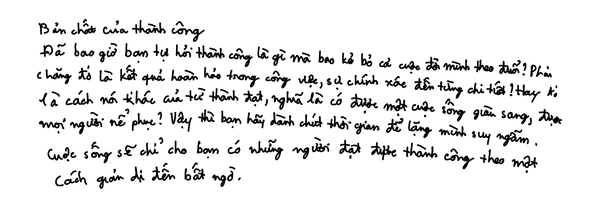
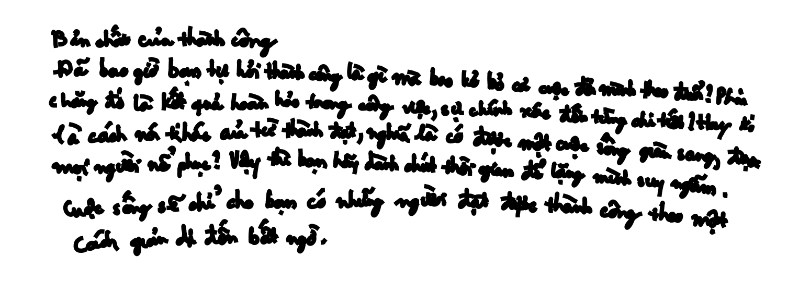

# VNOnDB Online to Offline dataset converter

# Introduction
> HANDS-VNOnDB2018 (VNOnDB2018 in short) is used for ICFHR2018 Competition on Vietnamese Online Handwritten Text Recognition using VNOnDB. It provides 1,146 Vietnamese paragraphs of handwritten text composed of 7,296 lines, more than 480,000 strokes and more that 380,000 characters written by 200 Vietnamese.

For more information about this dataset, please go to the [main page](http://tc11.cvc.uab.es/datasets/HANDS-VNOnDB2018_1/)

# Examples
With `dpi=300`, below are some examples from database after converted

| Level | `line_width=1` | `line_width=2` |
| --- | --- | --- |
| word |  |  |
| line |  |  |
| paragraph |  |  |


# Prerequisite
Install libraries
- `pip install -r requirements.txt`

You also have dataset **and** datasplit downloaded and extracted. Your directory might as follow:
```
.git/
.gitignore
InkData_line/
InkData_paragraph/
InkData_word/
lib.py
LICENSE
main.py
README.md
requirements.txt
VNOnDB_ICFHR2018_dataSplit/
```

# Run
**Note:** This is very time consuming process. I have used multiprocess to speedup, but it depends on your machine

## Help
- `python --help` for help

## Quick run!
- To convert line
  - `python main.py ./InkData_line ./line`
- To convert word
  - `python main.py ./InkData_word ./word`
- To convert paragraph
  - `python main.py ./InkData_paragraph ./paragraph`

## Detail
`python <data_path> <output_dir> --line_width <line_width> --dpi <dpi>`

- `<data_path>` is a directory contains `*.inkml` files of dataset, will be one of `InkData_word`, `InkData_line` or `InkData_paragraph` if download and extract from the main page
- `<output_dir>` prefix of the directories
  - e.g. if `<output_dir>=./word`, this will create `./word_train`, `./word_val` and `./word_test` directories
- *(Optional)* `<line_width>` is line stroke width, default is `2`
- *(Optional)* `<dpi>`, default is `300`
