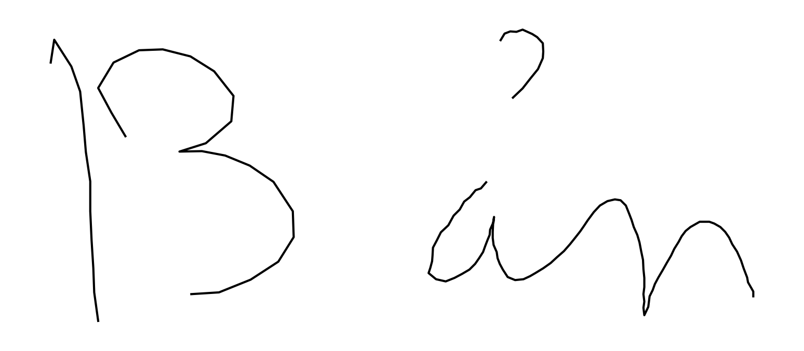
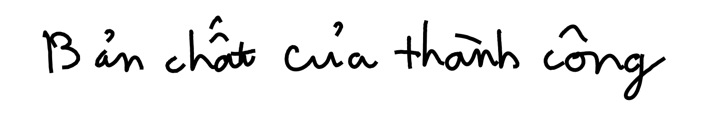

# VNOnDB Online to Offline dataset converter

# Introduction
> HANDS-VNOnDB2018 (VNOnDB2018 in short) is used for ICFHR2018 Competition on Vietnamese Online Handwritten Text Recognition using VNOnDB. It provides 1,146 Vietnamese paragraphs of handwritten text composed of 7,296 lines, more than 480,000 strokes and more that 380,000 characters written by 200 Vietnamese.

For more information about this dataset, please go to the [main page](http://tc11.cvc.uab.es/datasets/HANDS-VNOnDB2018_1/)

# Examples
With `dpi=300`, below are some examples from database after converted

| Level | `line_width=1` | `line_width=2` |
| --- | --- | --- |
| word |  |  |
| line |  |  |
| paragraph |  |  |


# Prerequisite
Install libraries
- `pip install -r requirements.txt`

You also have dataset **and** datasplit downloaded and extracted. Your directory might as follow:
```
.git/
.gitignore
data/InkData_line/
data/InkData_paragraph/
data/InkData_word/
data/VNOnDB_ICFHR2018_dataSplit/
images/
LICENSE
convert.py
convert.ipynb
README.md
requirements.txt
```

# Run
**Note:** This is a very time consuming process!!

## Help
- `python convert.py --help` for help

## Quick run!
- To convert line
  - `python convert.py line`
- To convert word
  - `python convert.py word`
- To convert paragraph
  - `python convert.py paragraph`

**Note**: Results `*.csv` files and image folders will be stored in `./data`

## Detail
`python convert.py --line_width <line_width> --dpi <dpi> --label_only`
- *(Optional)* `<line_width>` is line stroke width, default is `2`
- *(Optional)* `<dpi>`, default is `300`
- *(Optional)* `--label_only`, if specified, this will only generate `*.csv`. This is useful in case you already have images and just need the label files.